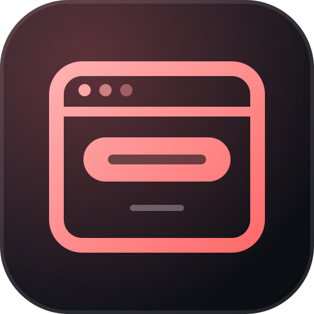

<div align="center">



# How Not To Build A Website

**A working fake SaaS that teaches 30 dark patterns by showing them in context.**<br>
Every page has a **?** button that explains which patterns are live and why they work.

[](LICENSE)
[](https://github.com/obrenoalvim/how-not-to-build-a-website/stargazers)
[](#pages)
[](#stack)

**English** · [Português](README.pt.md)

[Pages](#pages) · [Stack](#stack) · [Running it](#running-it) · [Why](#why) · [FAQ](#faq)

</div>

---

A working fake SaaS ("Flowly") built to showcase bad-but-common UX practices (dark patterns and the cognitive biases they exploit) in context, on real pages, instead of as a bullet list.

Every page has a **?** button in the bottom-right corner explaining exactly which
patterns are live on that page and why they work. A `/patterns` page lists the full
catalog of 30, grouped by mechanism.

## Pages

| Route | What's being demonstrated |
|---|---|
| `/` | fake countdown, fake activity counter, disguised ad, exit-intent confirmshaming, competing CTAs |
| `/signup` | information-overload form, pre-ticked opt-in, buried validation, fake scarcity, hidden password rules |
| `/login` | oversized social login, vague errors, buried password reset |
| `/pricing` | decoy pricing tier, fake price anchor, drip pricing, fake "most popular" badge |
| `/checkout` | sneaked-in add-on, forced account creation, last-step fees, stacked urgency, confirmshaming |
| `/dashboard` | fake progress bar, evasive upgrade banner, fake notification badge |
| `/account` | cancellation buried in menus, guilt-trip retention screen, forced phone call, infinite discount-offer loop |
| `/patterns` | the full catalog, browsable independent of the demo pages |

Global (every page): asymmetric cookie consent banner, unsolicited chat nag.

## Stack

Next.js (App Router) + TypeScript + Tailwind CSS. No backend, no database. Every
"account" and "payment" on the site is inert UI.

## Running it

```bash
npm install
npm run dev
```

Open http://localhost:3000.

## Why

Educational/portfolio project. None of this is meant to actually manipulate a real
visitor. The point is that clicking the **?** immediately tells you what's wrong and
why it works, which is the opposite of how these patterns behave in the wild.

---

## FAQ

**Is this a real product?**
No. "Flowly" is a fake SaaS. Every "account" and "payment" on the site is inert UI, with no backend and no database.

**Which dark patterns does it cover?**
30, grouped by mechanism on the `/patterns` page. Examples: fake countdowns, confirmshaming, pre-ticked opt-ins, decoy pricing, drip pricing, buried cancellation and an asymmetric cookie banner.

**How do I see which patterns a page uses?**
Click the **?** button in the bottom-right corner of any page. It lists the patterns live on that page and why they work.

**Can I use it to teach a UX class?**
It is an educational project. Run it locally and walk through the pages in the order listed under [Pages](#pages).

## More from the same author

- [**diff-viewer**](https://github.com/obrenoalvim/diff-viewer): compare two pieces of text and see what changed, in your browser.
- [**status-hub**](https://github.com/obrenoalvim/status-hub): one grid for every status page you check.

## Contributing

Know a dark pattern the catalog misses? Open an issue or a PR. See [CONTRIBUTING.md](CONTRIBUTING.md) and the [changelog](CHANGELOG.md).

## License

[MIT](LICENSE)

---

<div align="center">

If this made you recognize a dark pattern, a ⭐ helps other people find it.

<sub>**Topics:** dark-patterns · deceptive-design · ux · ux-education · cognitive-bias · confirmshaming · demo-site · nextjs · typescript · tailwindcss</sub>

</div>
